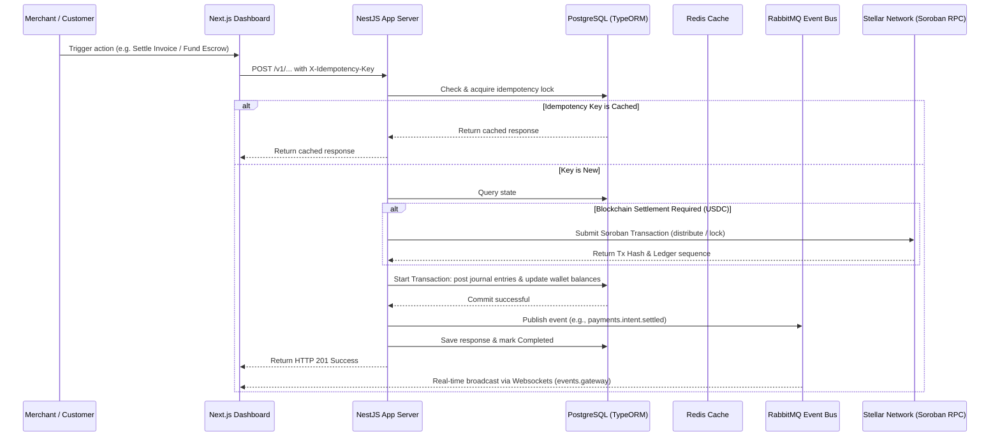

# Maringa: Core App Server & Event Gateway (NestJS Backend)

This is the core command-processing and ledger orchestration service for Maringa. It exposes REST APIs for organizational onboarding, programmable wallets, invoicing, and escrow management, and propagates real-time financial updates to the dashboard via WebSockets.

---

## ⛓️ Live Stellar Settlement Layer

The backend orchestrates settlement against two Soroban contracts deployed live on Stellar Testnet (`Test SDF Network ; September 2015`):

| Contract | Contract ID | Explorer |
| --- | --- | --- |
| Milestone Escrow | `CA2FBFRN6Y2WUFCYTN43URSLTOQEULCO65TFEUWD4HMJQCARDEUJYKDD` | [Stellar Expert](https://stellar.expert/explorer/testnet/contract/CA2FBFRN6Y2WUFCYTN43URSLTOQEULCO65TFEUWD4HMJQCARDEUJYKDD) |
| Revenue Splitter | `CC3YJ6BAEM2EOMCOYX3UVY3DNNQ26PDA7N5KXMWRTS7HD4CWNCGZH7JM` | [Stellar Expert](https://stellar.expert/explorer/testnet/contract/CC3YJ6BAEM2EOMCOYX3UVY3DNNQ26PDA7N5KXMWRTS7HD4CWNCGZH7JM) |

A verified on-chain 60/40 revenue split (`distribute`) is viewable [here](https://stellar.expert/explorer/testnet/tx/f404c8e0f0c80b365069a33ec3318605ab25d52ea46c77ddbc5328b0893a9b04).

---

## 🏗️ System Architecture & Data Flow

The backend employs a database-backed double-entry ledger that guarantees accounting invariants, paired with a command idempotency lock system.



---

## 🗄️ Relational Database Schema (TypeORM + PostgreSQL)

We use **TypeORM** as the ORM to manage connections and run transactions in PostgreSQL:

*   **Organizations (`organizations`):** Core merchant/legal entities.
*   **Members (`members`):** Authorized users mapped to organizations.
*   **Wallets (`wallets`):** Accounts holding multi-currency balances (USDC, NGN, KES) stored dynamically in `jsonb` columns.
*   **Accounts (`accounts`):** Ledger accounts (Assets, Liabilities, Equity).
*   **Journal Entries & Transaction Lines (`journal_entries`, `transaction_lines`):** Balanced, immutable double-entry records.
*   **Payment Intents (`payment_intents`):** Inbound merchant payments tracking.
*   **Invoices (`invoices`):** Stateful billing objects carrying split routing commands.
*   **Escrows (`escrows`):** Off-chain mirrors of deployed Stellar/Soroban contracts.
*   **Idempotency Keys (`idempotency_keys`):** Anti-replay database cache.

---

## 🚀 Running Locally

### 1. Prerequisites
Ensure the root infrastructure is active (Postgres, Redis, RabbitMQ, Stellar RPC):
```bash
npm run docker:up --prefix ../
```

### 2. Configure Environment
Create a `.env` file from the example:
```bash
cp .env.example .env
```

### 3. Start Development Server
```bash
npm install
npm run start:dev
```
The server will bind to port `3001` with CORS enabled.

---

## 🧪 CI/CD Workflow

The project's GitHub Actions workflow is located at [.github/workflows/ci.yml](file:///home/samuel/works/waves/maringa/backend/.github/workflows/ci.yml). On every push or pull request to the `main` branch, it runs:
1.  **Code Checkout**
2.  **Node.js Environment Setup**
3.  **Dependencies Installation** (`npm ci`)
4.  **Lint checks**
5.  **NestJS Compilation Check** (`npm run build`)
